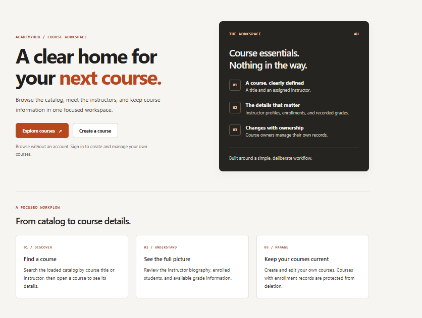
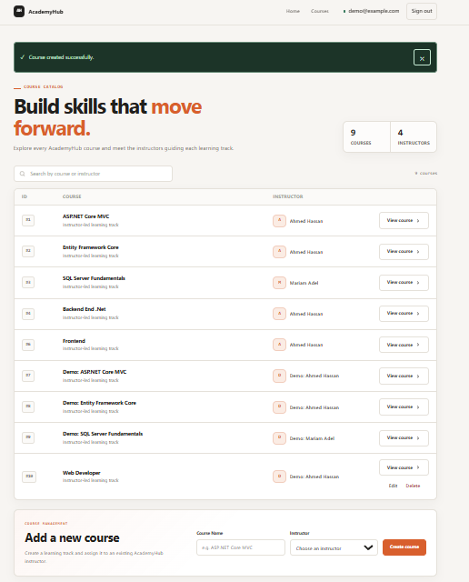
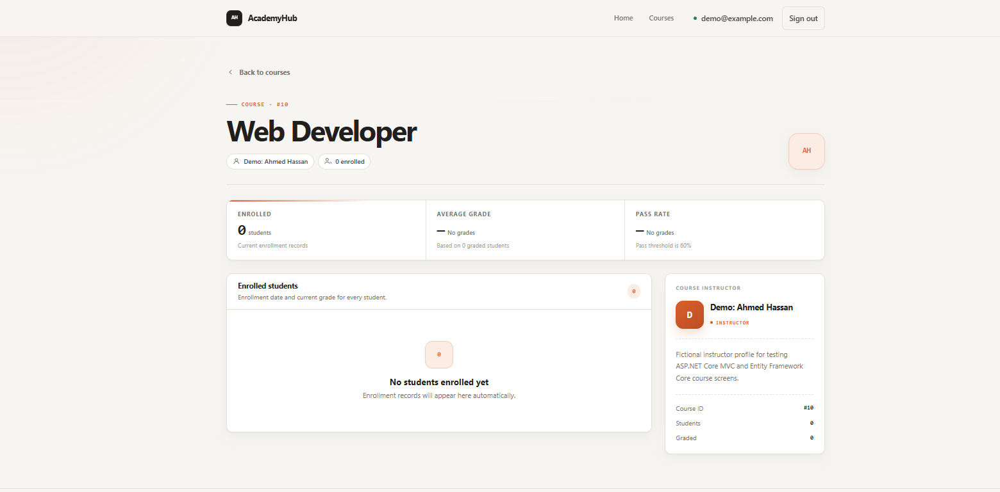
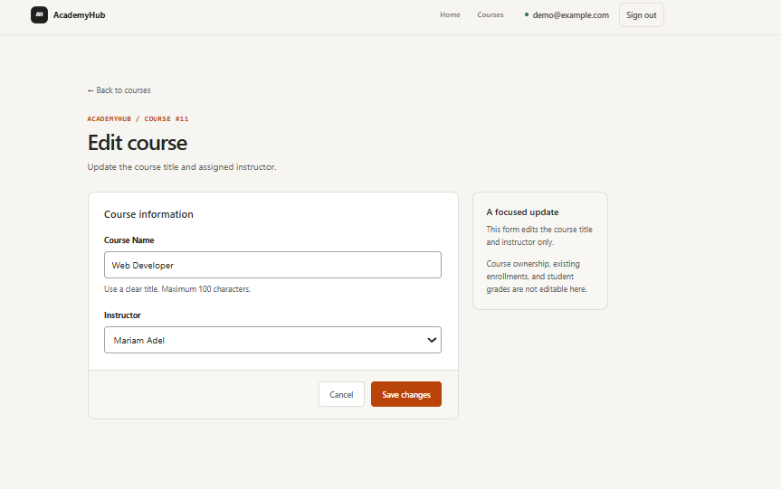
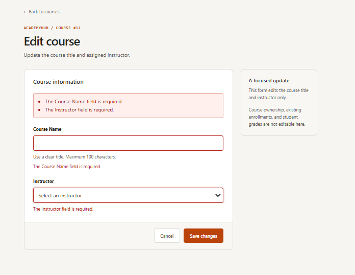
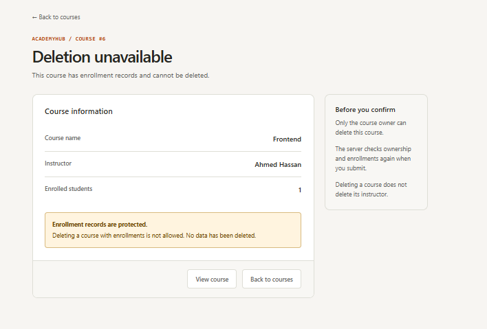

# AcademyHub

**A focused ASP.NET Core MVC course-management project with account-based ownership.**

AcademyHub combines a public course catalog with authenticated course creation, editing, and deletion. It was built to practice backend fundamentals: relational modeling, Entity Framework Core, dependency injection, repository boundaries, ViewModels, mapping, validation, authentication, and resource-level authorization.

The interface follows an Ink & Ember visual style, with separate page stylesheets and shared navigation.

> **Scope:** a learning/demo application, not a complete learning-management system or a production-ready service. Use fictional student records only: course detail pages currently expose enrollment names and grades to public visitors.

## Features

### Public catalog

- Browse courses and their assigned instructors.
- Search loaded course rows by title or instructor in the browser.
- View course details, instructor biographies, enrollments, and available grades.
- Distinguish ungraded enrollments from numeric grades.
- Show empty states when a course has no enrollments.

### Accounts and course ownership

- Register, sign in, and sign out using the default ASP.NET Core Identity UI.
- Create a course while signed in.
- Set the course owner from the authenticated user's identifier, never from a form field.
- Allow only the owner to edit or delete a course.
- Re-check ownership in POST actions; hiding navigation links is not the authorization mechanism.

### Validation and deletion policy

- Validate course titles and instructor selection on the server.
- Verify that a submitted instructor identifier exists in the database.
- Re-populate dropdown options when validation fails while retaining submitted values and errors.
- Protect state-changing forms with antiforgery validation.
- Require a confirmation POST to delete a course.
- Reject deletion when the course has enrollment records.
- Use success messages and Post/Redirect/Get after successful changes.

## Technology

| Component | Project version / approach |
| --- | --- |
| ASP.NET Core MVC | .NET 9 (`net9.0`) |
| Entity Framework Core | 9.0.20 |
| SQL Server provider and EF tools | 9.0.20 |
| ASP.NET Core Identity EF stores and UI | 9.0.20 |
| AutoMapper | 16.2.0 |
| Database for local development | SQL Server LocalDB |
| UI | Razor, CSS, Bootstrap, and small JavaScript enhancements |

These are the versions in the project file, not a claim that they are the latest supported versions. Check framework support, package compatibility, and AutoMapper licensing requirements before a public deployment or upgrade. Do not commit a license key or other secret.

## Application structure

```text
HTTP request
    ↓
MVC controller
    ├── ViewModels, validation, and ownership checks
    ├── AutoMapper for selected entity/ViewModel transformations
    ├── ICourseRepository → TrainingDbContext → training database
    └── UserManager<ApplicationUser> → Identity stores → account database
    ↓
Razor view
```

Editing updates the existing tracked `Course` entity's allowed properties. It does not map arbitrary submitted fields onto ownership or enrollment data.

### Domain relationships

```text
Instructor 1 ─── 0..1 InstructorProfile
Instructor 1 ─── *    Course
Student    1 ─── *    Enrollment
Course     1 ─── *    Enrollment

Enrollment primary key: (StudentId, CourseId)
```

`Enrollment` is the join entity between students and courses, carrying an enrollment date and an optional grade.

### Two database contexts

| Context | Connection-string key | Local database |
| --- | --- | --- |
| `TrainingDbContext` | `TrainingConnection` | `AcademyHubTrainingDb` |
| `IdentityAppDbContext` | `IdentityConnection` | `AcademyHubIdentityDb` |

`Course.CreatedByUserId` records the Identity user's string identifier. This is an application-level reference, not a cross-database foreign key. Deleting an Identity account does not automatically delete its training records.

```text
Controllers/
Data/
Identity/
Mapping/
Models/
Repositories/
ViewModel/
Views/
    Home/
    Course/
    Shared/
wwwroot/css/
    site.css
    layout.css
    pages/
scripts/
    seed-demo.sql
```

Commit the existing migration files and model snapshots wherever they reside in the project. Do not move them just to match this overview.

## Run locally

### Requirements

The documented setup uses **Windows** with:

- .NET 9 SDK.
- A Visual Studio version capable of building .NET 9 projects, with the ASP.NET/web workload.
- SQL Server Express LocalDB (`(localdb)\MSSQLLocalDB`).
- SQL Server Management Studio or another SQL Server client for the optional demo-data script.

LocalDB is Windows-specific. For another operating system, use an accessible SQL Server instance and adapt both connection strings; that environment is not the setup verified during development.

### 1. Open and build the project

Clone or download this repository, open its solution if included, or open `AcademyHub.csproj` in Visual Studio. Restore NuGet packages and build.

From the directory containing the project file, the basic build can also be run with:

```bash
dotnet restore
dotnet build
```

### 2. Check connection strings

The default `appsettings.json` uses local Windows authentication without a database password:

```json
"ConnectionStrings": {
  "TrainingConnection": "Data Source=(localdb)\\MSSQLLocalDB;Database=AcademyHubTrainingDb;Trusted_Connection=True;Encrypt=True;TrustServerCertificate=True",
  "IdentityConnection": "Data Source=(localdb)\\MSSQLLocalDB;Database=AcademyHubIdentityDb;Trusted_Connection=True;Encrypt=True;TrustServerCertificate=True"
}
```

The certificate-trust setting is for this local development configuration, not a general production recommendation. If using a hosted database, keep credentials out of the repository and use an appropriate secret/configuration mechanism.

### 3. Apply existing migrations

In Visual Studio, open **Tools → NuGet Package Manager → Package Manager Console**. Select AcademyHub as the default project and the startup project, then run:

```powershell
Update-Database -Context TrainingDbContext
Update-Database -Context IdentityAppDbContext
```

These commands create/update the two databases using the committed migrations. They must be run against the intended development connections.

**Do not run `Add-Migration` just to install this application.** If no migrations are present in the checkout, the repository is incomplete and should be corrected before attempting setup.

> The setup above intentionally uses Package Manager Console. The project currently references `Microsoft.EntityFrameworkCore.Tools`, but does not explicitly reference `Microsoft.EntityFrameworkCore.Design`; a separate `dotnet ef` workflow may require additional tooling/configuration and is not documented as ready to run here.

### 4. Optional: load demo data

Open `scripts/seed-demo.sql` in your SQL Server client, select `AcademyHubTrainingDb`, and execute the whole file.

It adds:

- Two fictional instructors with profiles.
- Five fictional students.
- Three demo courses.
- Five enrollments, including a pending grade.
- One course with no enrollments for the empty-state screen.

It does not insert accounts, passwords, or Identity records, and does not delete or overwrite existing data. Re-running it sequentially reuses matching demo records. Read the comments at the top before execution.

**Demo ownership:** seeded courses default to the marker `demo-seed`, which is not a real Identity user. They can be viewed, but an ordinary registered account cannot edit or delete them. Create your own course through the application to test owner-authorized CRUD. If you intentionally customize demo ownership, do so only in your local development copy as explained in the script.

### 5. Start and register

Run the project through Visual Studio's development profile. Use the application address shown by the launch profile/browser; the port is not fixed by this README.

Useful routes:

```text
/                             Home
/Home/Privacy                 Privacy and demo-use notice
/Course/Index                 Catalog and authenticated creation form
/Course/Details/{id}          Course details
/Course/Edit/{id}             Owner-only edit page
/Course/Delete/{id}           Owner-only deletion confirmation
/Identity/Account/Register    Register
/Identity/Account/Login       Sign in
```

Use a demo account and a password created specifically for this project. Account confirmation is not required in the current configuration. Outbound email delivery is not configured, so do not assume email-confirmation or password-reset email delivery is operational.

## Suggested walkthrough

1. Browse a seeded course and inspect its enrollments.
2. Register a demo account.
3. Create a course using an instructor from the dropdown.
4. Edit that course and verify its owner identifier is unchanged.
5. Submit an invalid title and verify the form shows errors without saving.
6. Delete a newly created course without enrollments.
7. Verify that a course owned by another identifier cannot be edited or deleted.
8. In a controlled demo database, verify that an owned course with an enrollment cannot be deleted.

The application currently has no enrollment-management UI. Adding an enrollment for the last scenario is a development SQL operation, not a published feature.

## Testing status

Development included manual checks for registration, course creation with the correct owner identifier, successful editing, invalid-title handling, owner/non-owner access, deletion, and enrollment-based deletion rejection. The rejection was also checked by adding an enrollment after opening a deletion confirmation and then submitting that older form.

No automated test suite is included in this baseline description. Final clean-checkout validation should be completed before presenting setup as fully reproducible. See [the release checklist](docs/RELEASE-CHECKLIST.md).

## Current boundaries and known limitations

- Not a complete LMS: no content delivery, payments, attendance, or certificates.
- No instructor/student CRUD or enrollment/grade-management UI in this version.
- No configured administrative role-management workflow.
- Catalog search is client-side over loaded rows; there is no server-side pagination.
- Public course details include demo student names and grades. Do not load real student data.
- Account deletion and training-data lifecycle are not integrated across the two databases.
- The deletion check and save are separate steps. SQL Server foreign keys protect referenced records, but a concurrent enrollment added after the check can still cause a database exception that needs deliberate handling before production use.
- Entity validation attributes such as `[Range]` do not automatically establish an equivalent SQL Server CHECK constraint. Direct SQL must respect valid values.
- Login/Register use the default Identity UI. The shared navigation is customized; the account pages themselves are not a bespoke redesign.
- The general error page is not a complete custom 403/404 handling system.
- Framework support, dependency licensing, secrets management, logging, HTTPS/certificates, backups, and deployment policies require review before hosting for real users.

## Future iteration

A separate future scope can add instructor/student management, enrollments and grades, explicit roles, server-side search/pagination, and automated tests. These are planned improvements, not features of this version.


## Screenshots

### Home


### Course catalog
Public course browsing with an authenticated course-creation form. This screen shows the success message after creating a course with a demo account.



### Course details and empty state
Course information, instructor profile, and a clear empty state when no students are enrolled.



### Edit course
The edit form allows changes to the course title and assigned instructor.



### Form validation
Required-field errors are displayed in a summary and beside the relevant controls.



### Enrollment-aware deletion
The deletion screen displays a warning and omits the delete action when the course has enrollment records.


